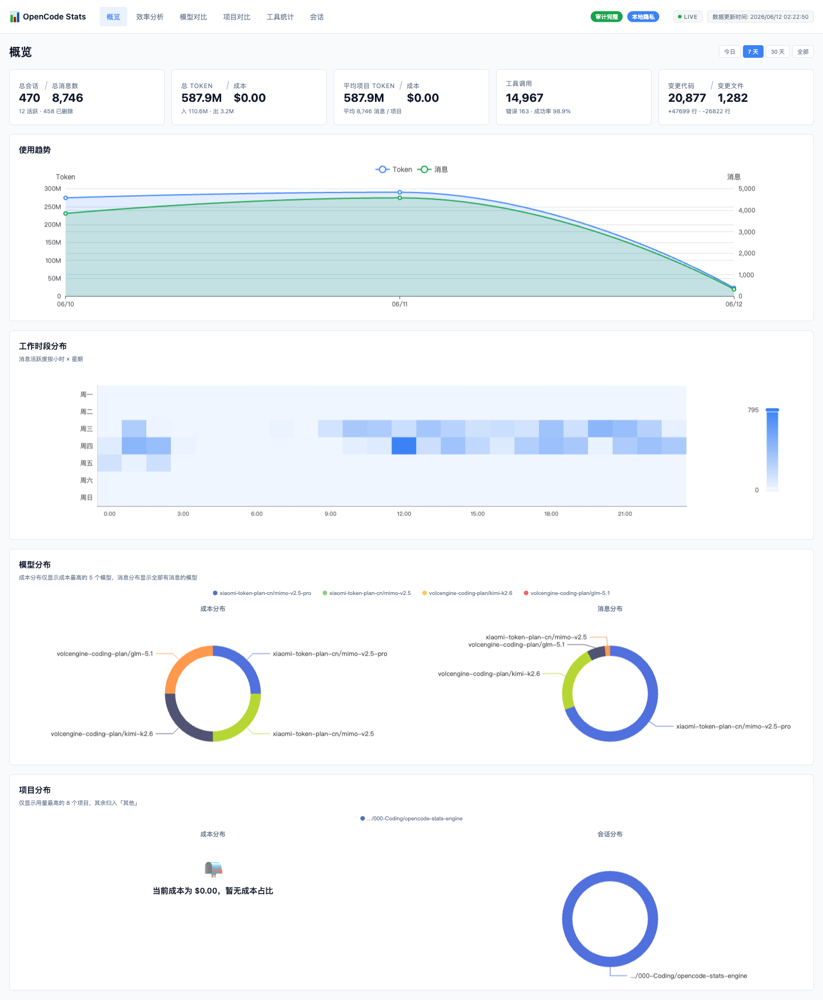
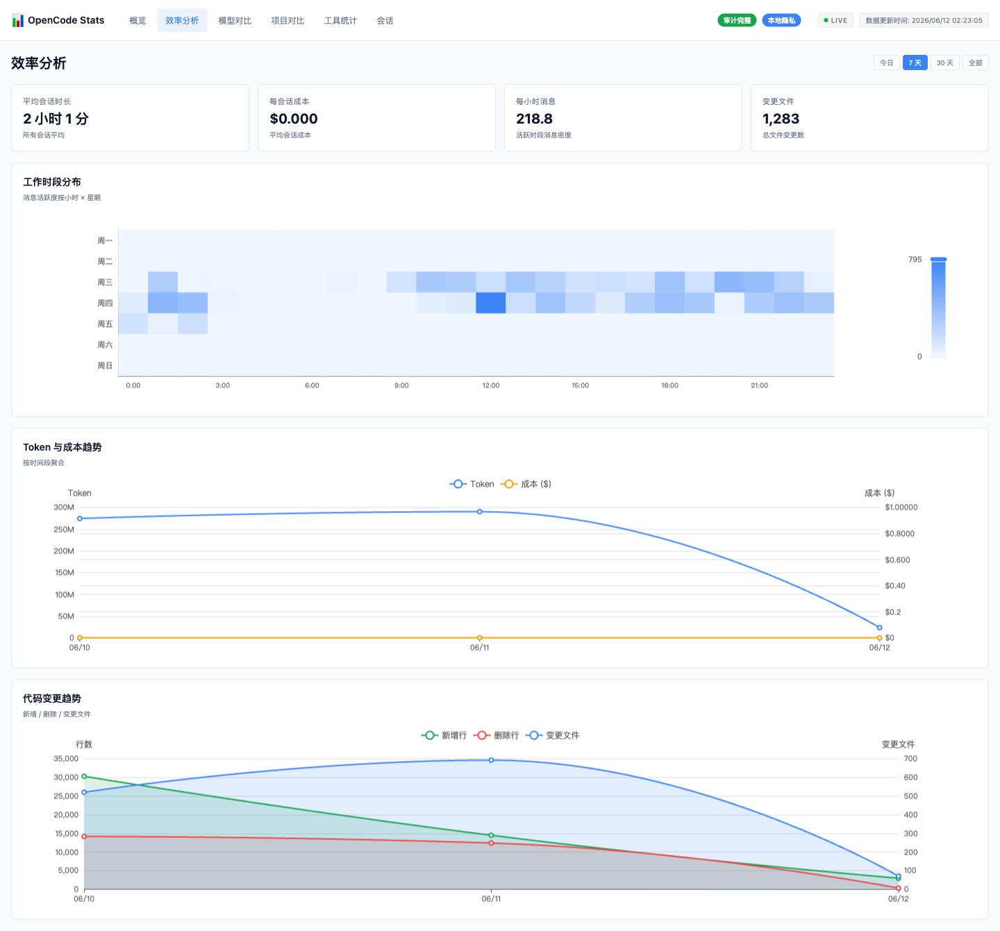
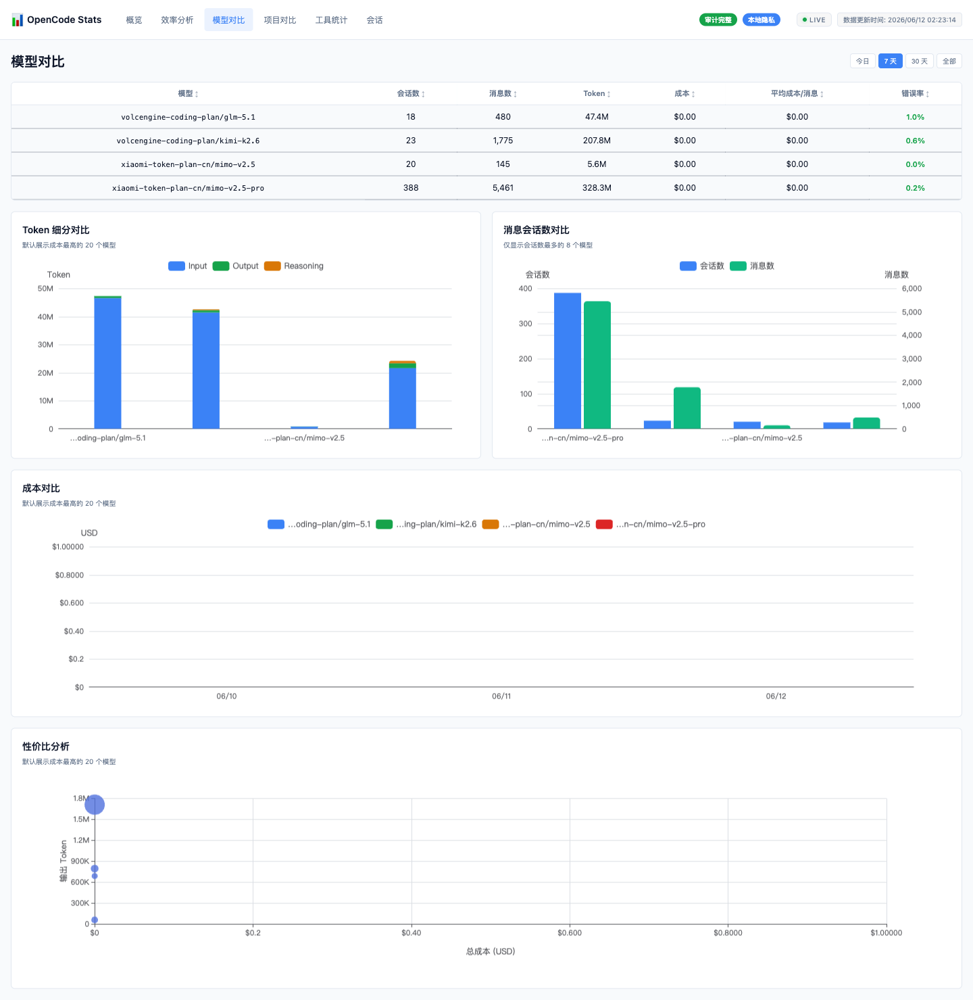
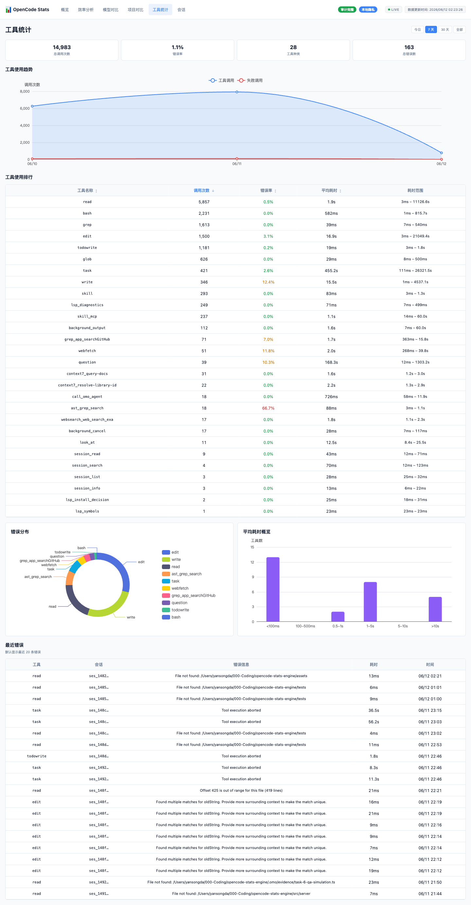
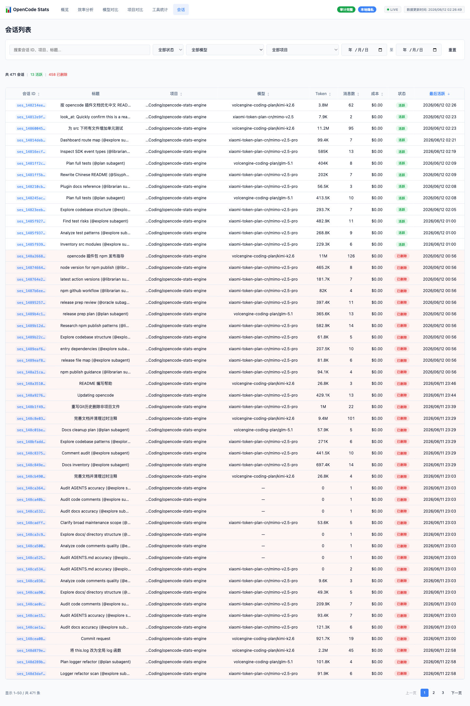

# opencode-stats-engine

OpenCode 事件溯源统计引擎插件。它会监听 OpenCode 事件，将会话、消息和工具执行数据写入本地 SQLite，并提供本地统计仪表盘、REST API 和 SSE 实时更新。

## 快速开始

根据 OpenCode 官方插件机制，只需要在 `opencode.json` 中把插件包名加入 `plugin` 数组：

```json
{
  "$schema": "https://opencode.ai/config.json",
  "plugin": ["opencode-stats-engine"]
}
```

保存配置后正常启动 OpenCode。OpenCode 会按插件配置加载 `opencode-stats-engine`；插件加载后会初始化本地数据库、投影引擎和 HTTP 服务，并通过通用 `event` 钩子处理 OpenCode 事件。

然后在浏览器打开：

```text
http://127.0.0.1:11133
```

默认端口是 `11133`，可通过 `STATS_PORT` 修改。

## 这个插件做什么

- **事件采集**：监听 OpenCode 的会话、消息、工具执行等事件。
- **本地持久化**：将事件追加写入 SQLite，默认数据库路径为 `~/.local/share/opencode-stats-engine/stats.db`。
- **统计投影**：把原始事件投影成会话、消息、工具调用等统计表。
- **本地仪表盘**：通过 Hono 提供 Dashboard 页面和 `/api/v1/dashboard/*` API。
- **实时更新**：通过 `/api/v1/dashboard/stream` 向仪表盘推送 SSE 更新通知。
- **多实例协调**：多个 OpenCode 实例同时运行时，只有 leader 提供 HTTP 服务，follower 继续写入本地数据。

## 环境变量

| 变量 | 默认值 | 说明 |
| --- | --- | --- |
| `STATS_PORT` | `11133` | 本地仪表盘和 API 监听端口 |
| `STATS_DB_DIR` | `~/.local/share/opencode-stats-engine/` | SQLite 数据库和日志文件目录 |
| `STATS_DB_PATH` | `$STATS_DB_DIR/stats.db` | SQLite 数据库文件路径 |

## 仪表盘与 API

插件内置预构建的 Vue 3 仪表盘，运行后提供：

- `GET /api/v1/dashboard/overview`
- `GET /api/v1/dashboard/efficiency`
- `GET /api/v1/dashboard/models`
- `GET /api/v1/dashboard/projects`
- `GET /api/v1/dashboard/tools`
- `GET /api/v1/dashboard/sessions`
- `GET /api/v1/dashboard/sessions/:id`
- `GET /api/v1/dashboard/stream`（SSE）

所有 Dashboard API 都支持可选 `tz` 查询参数，例如 `Asia/Shanghai`、`America/New_York`。`tz` 只影响日期/小时分桶展示；数据库中的时间戳和所有 `*_ms` 字段始终保持 UTC 毫秒 epoch。

## 数据与隐私

- 数据只写入本地 SQLite，不上传到远程服务。
- Dashboard API 不返回消息正文、工具输入、工具输出或原始 payload。
- `tool_input`、`tool_output`、`message_body`、`raw_input`、`raw_output` 等字段不会进入可展示元数据。
- 日志默认写入 `STATS_DB_DIR/stats.log`，用于本地排查。

## 开发

以下内容仅面向本仓库开发者。项目使用 Bun、TypeScript、Biome、Hono，以及位于 `dashboard/` 的 Vue 3 仪表盘。

```bash
bun install
bun run biome:check
bun run typecheck
bun test
bun run build:dashboard
bun run build
```

常用测试命令：

```bash
bun test
bun test tests/projection/engine.test.ts
bun test --test-name-pattern "routes"
```

自动修复：

```bash
bun run biome:fix
bun run biome:fix-unsafe
```

## 包信息

| 项目 | 值 |
| --- | --- |
| 包名 | `opencode-stats-engine` |
| 当前版本 | `1.0.0-beta.0` |
| 模块类型 | ESM |
| 入口文件 | `dist/index.js` |
| 类型声明 | `dist/index.d.ts` |
| 主要依赖 | `@opencode-ai/plugin`、`@opencode-ai/sdk`、`hono` |
| 许可证 | MIT |

## 仪表盘预览

### 总览



### 效率分析



### 模型统计



### 工具调用



### 会话列表



## 发布检查清单

发布到 npm 前执行：

```bash
bun run biome:check
bun run typecheck
bun test
bun run build:dashboard
bun run build
npm pack --dry-run
```

检查 `npm pack --dry-run` 输出，确认包内包含 `dist/`、`dashboard/dist/`、`README.md`、`LICENSE` 和 `package.json`，且不包含测试源码、仪表盘源码、`node_modules` 或本地依赖目录。

确认无误后发布：

```bash
npm publish --access public
```

## 许可证

MIT
